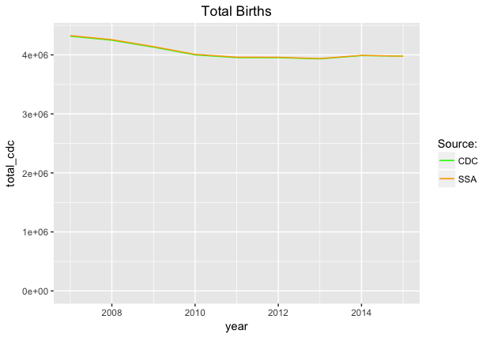
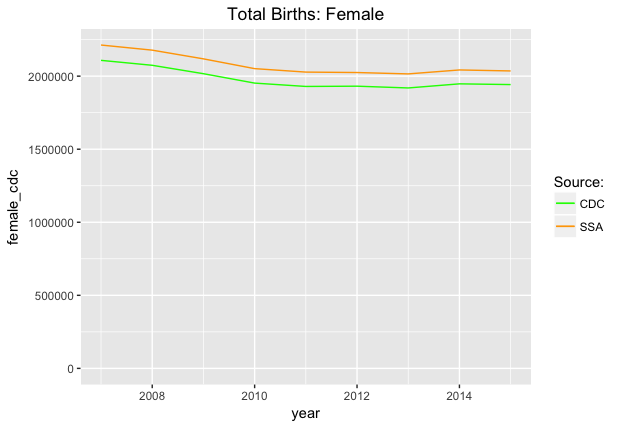
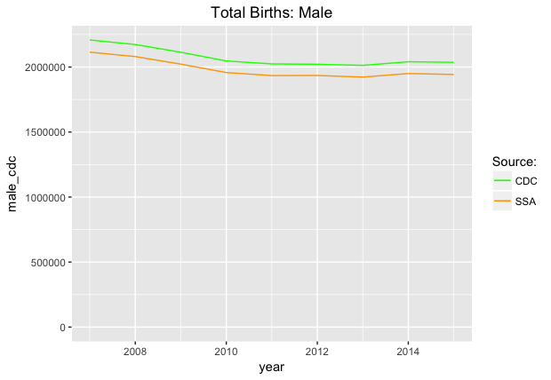

# Total Births Per Year

The Social Security Administration releases the [total number of new social security numbers](https://www.ssa.gov/oact/babynames/births.html) issues each year, but does not break out this data by state, which is useful if one is studying [baby names on a state level](https://www.ssa.gov/oact/babynames/state/). Fortunately, the [CDC releases natality data](https://wonder.cdc.gov/natality-current.html) by state and year, so the purpose of this repository is to compare the datasets and see if it's possible to impute state births from the SSA data using CDC data.

# Important Note
This repository contains extracts from the CDC WONDER tool that requires that you agree to the terms on [this page](https://wonder.cdc.gov/natality-current.html). You MUST abide by these terms if you use this dataset.

# Sources
The unadulterated source files from the SSA and CDC are in the `sources` directory. I lighted cleaned up the files for optimal importation into R and placed the clean versions in the `data` directory.

# How They Compare
Curiously, the CDC and the SSA report almost the exact same number of live births per year, but disagree on the genders. These graphs are generated by `compare.R`.

